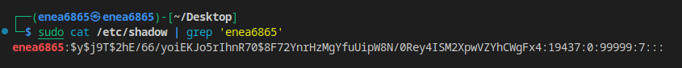

##
There are 2 types of encryption algorithms

###
- Substitution
- Shifting left or right (Transposition)

##
Substitution 

### 
WE SUBSITUTE THE VALUE WITH KEY ROMA
ASCII
1       A| VECAESAR (WE GOT THE VALUE FROM LETTER V AND SUPPOSE IT IS 1)
18      R| OMAROMAR (WE SEPARATE THE FIRST LETTER OF THE SUBSTITUTE CODE ROMA)
19      S| (S) IS THE Next character

##
One example we can see in our linux OS is 
- sudo cat /etc/shadow (to find hashed passwrod with salt) --> 
- after the user is ctreated the hash is applied and salt is applied after that and when then you loggin agaian the salt recognize the credentials according to the username nd the result of the salt added to the username should be the same as it is registered previously in the os. 

How can we find somebody passwords -- 
- Brute force attacks to get the has out of it
- Dictionary attacks (create a subset of what combination could be used. Social Eng is invoolved) 

excercise:

In future I need to get the user and the password from the file -- maybe in Final!!!!

4 things for chapter 6

- hash 
- hash _+ salt
- dictionary 
- brute force (homeworks)

Intro to API - prepare for next class

